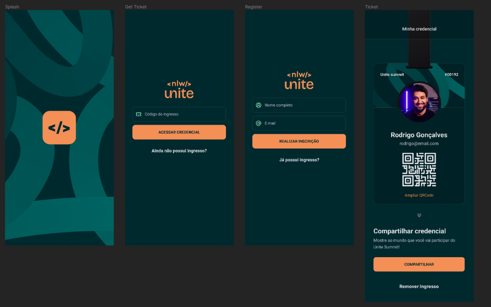

<h1 align="center">
  Pass.in
    <br>
    <br>
     <p align="center" >
  </p>

</h1>
   
 <div align="center">
  <sub>O Projeto. Feito por :
    <a href="https://github.com/Whuanderson">Whuanderson Marinho</a>
  </sub>
</div>

# pass.in

O pass.in é uma aplicação de **gestão de participantes em eventos presenciais**, criada no evento NLW da rocket Seat. 

A ferramenta permite que o organizador cadastre um evento e abra uma página pública de inscrição.

Os participantes inscritos podem emitir uma credencial para check-in no dia do evento.

O sistema fará um scan da credencial do participante para permitir a entrada no evento.

# 🚀 Tecnologias

* ReactJS - Biblioteca de JavaScript para construção de interfaces.
* React Native - Uma framework poderosa desenvolvida pelo Facebook que permite aos desenvolvedores construir aplicativos móveis utilizando JavaScript.
* Expo - Ferramenta utilizada no desenvolvimento mobile com React Native.
* TypeScript - Superset de JavaScript que adiciona tipagem estática ao código.
* Zustand - Biblioteca minimalista e prática para gerenciamento de estados no React e React Native.
* Nativewild - Usa Tailwind CSS como linguagem de script para criar um sistema de estilo universal para React Native.
* Tailwind - Framework de estilização.

# 🔖 Layout

Você pode visualizar o layout do projeto através [desse link](https://www.figma.com/file/se6fFnsN9YwV01rRDl5efY/pass.in-(Community)-(Copy)?type=design&node-id=7-2&mode=design&t=WHIfVogyCjkHFYQO-0). É necessário ter conta no [Figma](http://figma.com/) para acessá-lo.

# 📱  Instalando 

*Clone o projeto e acesse a pasta*

```bash
$ git clone https://github.com/Whuanderson/nlw-unite
```

# Executando o projeto

Utilize o **yarn** ou o **npm install** para instalar as dependências do projeto.
Em seguida, inicie o projeto.

```cl
npx expo start
```

# :closed_book: Licença

Feito por [Whuanderson Marinho](https://github.com/Whuanderson) 🚀.
Esse projeto está sobre [MIT license](./LICENSE).